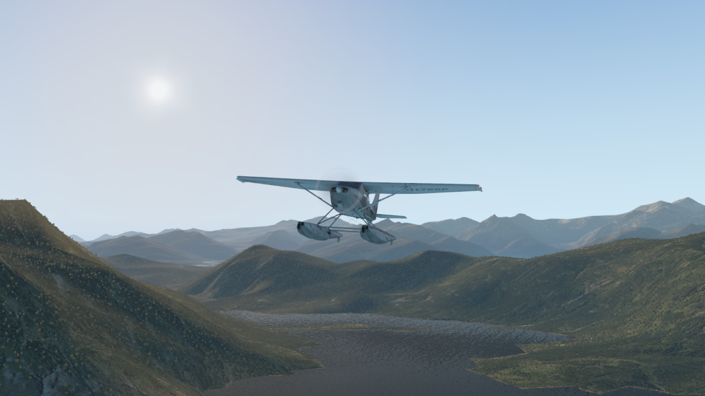
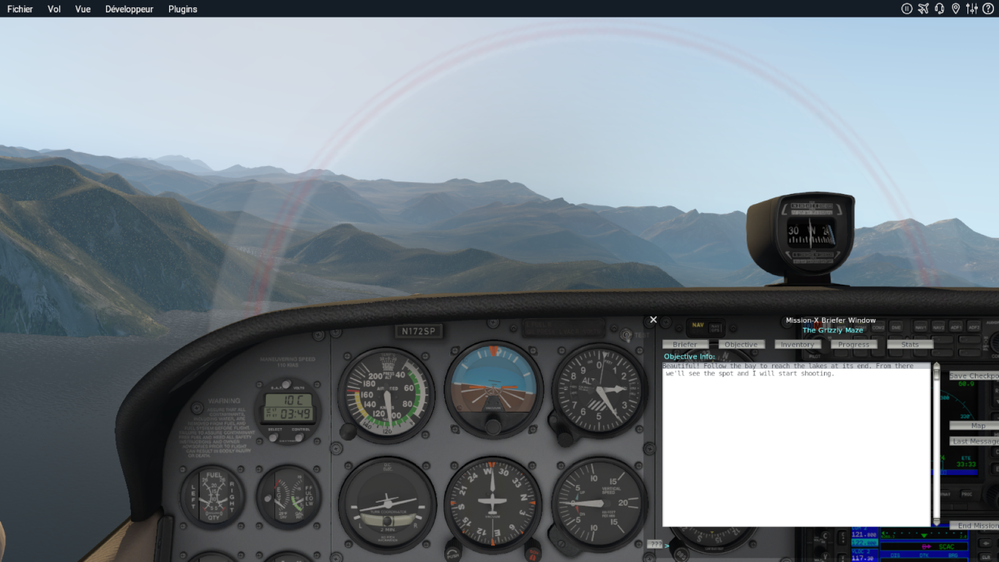
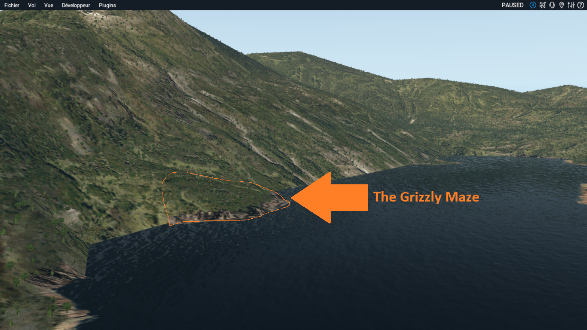
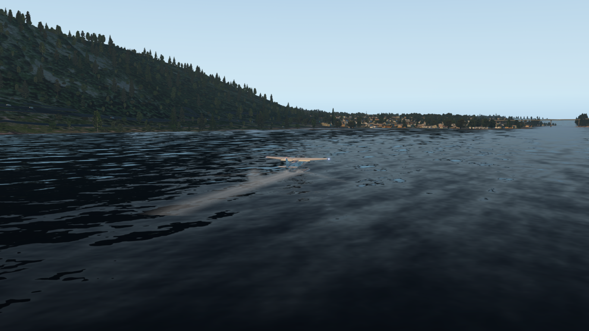

# The Grizzly Maze

The Grizzly Maze is a mission for X-Plane users, using the plugin missionx.

## The mission

In this mission, you will help the director Werner Herzog to shoot his two last clips for his documentary **The Grizzly Man**. You will fly the seaplane Cessna 172 with amphibious floats, and approaching the last campsite of american Timothy Treadwell who spent summers in what he called The Grizzly Maze, an area where he could observe and live with grizzly bears.

You will leave Kodiak Inner Harbor (9Z4) at the end of the afternoon and help the director for his shooting. Follow carefully his instructions.

The total time of the mission is around 1 hour and 20 minutes.

## Installation

You need to install X-Plane first, and the [MissionX plugin](https://forums.x-plane.org/index.php?/files/file/15389-mission-x-64bit/).

Then download [The.Grizzly.Maze_Extract.To.Xplane.Folder.zip](The.Grizzly.Maze_Extract.To.Xplane.Folder.zip) and extract its content in you X-Plane directory. The content of the mission will nicely fit in your X-Plane installation :

* The mission itself (XML file) in Resources/plugins/missionx/data/
* The maps useful to achive the mission in Custom Scenery/missionx/the_grizzly_maze/

The folders and files will be created without altering other plugins or missions.

## Screenshots

## Additional Informations

[Grizzly Man](https://en.wikipedia.org/wiki/Grizzly_Man), a film by Werner Herzog

[Timothy Treadwell](https://en.wikipedia.org/wiki/Timothy_Treadwell), the man who spent 13 summers living with grizzlies
